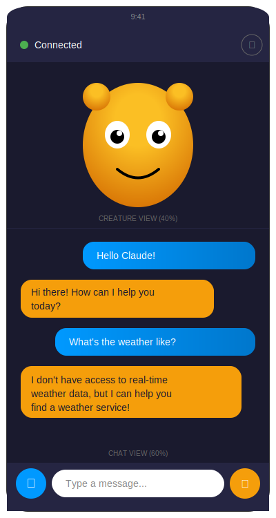

# Claude Companion

Android phone app with a Tamagotchi-style Claude creature and real-time chat view. Connects to the Claude Watch server via WebSocket for live updates.



## Features

- **Animated Creature** - Tamagotchi-style blob that reacts to Claude's state


| State | Trigger | Animation |
|-------|---------|-----------|
| Idle | Default | Gentle breathing, occasional blinks |
| Listening | Audio received | Ears perked, attentive eyes |
| Thinking | Processing | Eyes closed, thought bubbles |
| Speaking | Response ready | Happy bounce, talking mouth |
| Sleeping | 2+ min idle | Zzz particles, closed eyes |
| Offline | Disconnected | Sad expression, gray color |

- **Real-time Chat** - Messages appear instantly via WebSocket
  - User messages: Blue bubbles (right-aligned)
  - Claude messages: Orange bubbles (left-aligned)
  - Auto-scroll to newest message

- **Text Input** - Type messages to send to Claude
- **Voice Input** - Hold mic button to record, release to send
- **Kiosk Mode** - Fullscreen immersive mode (triple-tap top-left to exit)

## Requirements

- Android 8.0 (API 26) or higher
- Network access to Claude Watch server

## Setup

1. Build the app:
   ```bash
   ./gradlew assembleDebug
   ```

2. Install on phone:
   ```bash
   adb install -r app/build/outputs/apk/debug/app-debug.apk
   ```

3. Configure server address in Settings:
   - Tap the gear icon
   - Enter your server's IP and WebSocket port (e.g., `192.168.1.100:5567`)
   - Tap Save

## Server Requirements

The Claude Watch server must be running with WebSocket support:

```bash
# Start server (includes WebSocket on port 5567)
./server.py /path/to/project
```

### Server Endpoints Used

| Endpoint | Port | Description |
|----------|------|-------------|
| `ws://server:5567/ws` | 5567 | WebSocket for state & chat updates |
| `POST /api/message` | 5566 | Send text messages |
| `POST /transcribe` | 5566 | Send audio recordings |

## Project Structure

```
phone-app/
├── app/src/main/java/com/claudewatch/companion/
│   ├── MainActivity.kt           # Main UI + input handling
│   ├── SettingsActivity.kt       # Server config, kiosk toggle
│   ├── creature/
│   │   ├── CreatureView.kt       # Custom Canvas creature
│   │   └── CreatureState.kt      # State enum
│   ├── chat/
│   │   └── ChatAdapter.kt        # RecyclerView adapter
│   ├── network/
│   │   └── WebSocketClient.kt    # OkHttp WebSocket + StateFlow
│   └── kiosk/
│       └── KioskManager.kt       # Fullscreen mode
├── app/src/main/res/
│   ├── layout/
│   │   ├── activity_main.xml     # 40% creature / 60% chat split
│   │   ├── activity_settings.xml
│   │   ├── item_chat_user.xml    # Blue bubble
│   │   └── item_chat_claude.xml  # Orange bubble
│   └── values/
│       ├── colors.xml            # App color palette
│       └── themes.xml            # Dark theme
└── build.gradle.kts              # Dependencies
```

## Dependencies

- OkHttp 4.12.0 - WebSocket & HTTP
- Kotlin Coroutines - Async operations
- AndroidX RecyclerView - Chat list
- Material Components - UI elements

## Color Palette

| Element | Color |
|---------|-------|
| Background | `#1a1a2e` |
| Creature (light) | `#FBBF24` |
| Creature (dark) | `#D97706` |
| User bubble | `#0099FF` |
| Claude bubble | `#F59E0B` |
| Connected | `#4CAF50` |
| Disconnected | `#F44336` |

## License

Part of the Claude Watch project.
